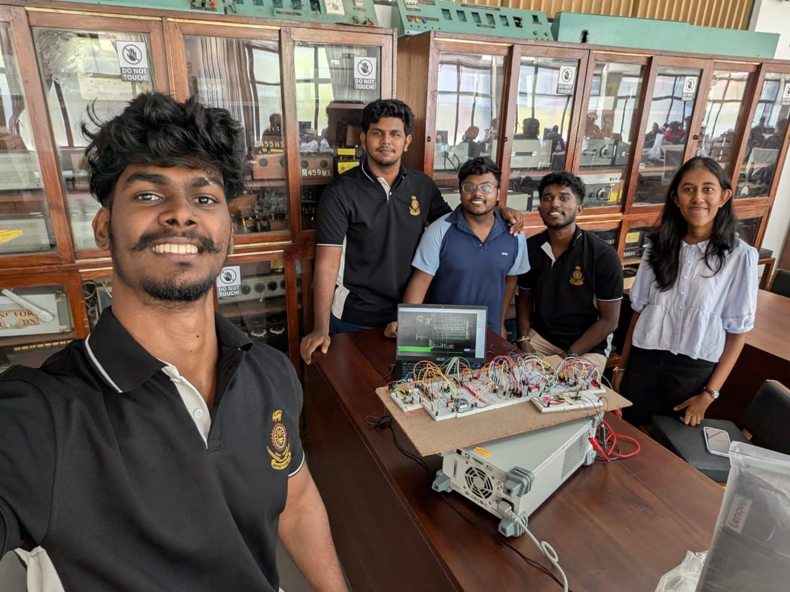
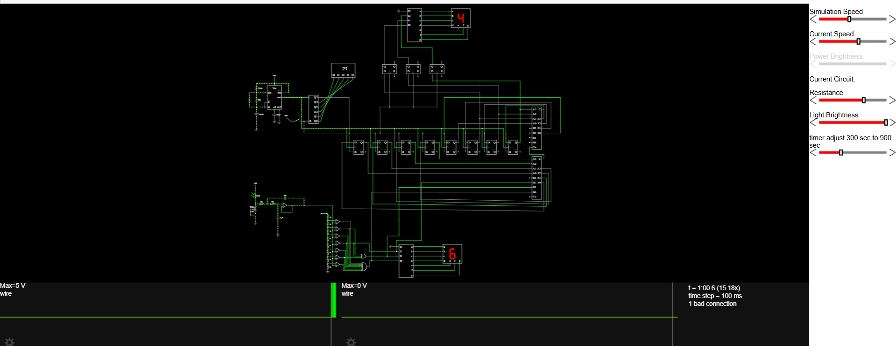

# The-Advanced-Light-Intensity-Indicator-ALII-Module
The ALII is a hardware-based light monitoring system that measures, filters, and displays real-time and average light levels using an LDR. It includes noise filtering, stability control, adjustable timing, and dual seven-segment displays, all built using only gate ICs and flip-flops.

[📖 Read this on Linkedin](https://www.linkedin.com/posts/dulsika-mendis-53640431a_digitalsignalprocessing-teamwork-sustainability-activity-7404901154700128256-2zWK?utm_source=social_share_send&utm_medium=member_desktop_web&rcm=ACoAAFDcrfoBfs-t0YrwyHS3fSSOQ8I4PrWgqeQ)

**<h1>📸 Project Snapshots</h1>**

|   |   |
|:--:|:--:|
| 👥 **Our Team** | 💡 **Product View** |

**<h1>🔍 Overview</h1>**
The Advanced Light Intensity Indicator (ALII) is a DSP-based hardware system designed to accurately measure, process, and display ambient light intensity. Using an LDR sensor, the system captures real-time light data and applies signal equalization and digital filtering to reduce noise. A dedicated stability logic module is included to prevent spurious triggers caused by sudden or short-term light fluctuations, ensuring reliable and consistent output. The processed data is used to display both instantaneous and average light intensity values on seven-segment displays, making the system suitable for applications requiring consistent and reliable light monitoring.

**<h1>🏗️ System Architecture</h1>**

• Light Sensor (LDR): Detects ambient light intensity and converts it into an analog signal.

• Signal Conditioning & Filtering: Removes noise and smooths fluctuations from the raw sensor signal.(Sallen-Key second order low pass filter)

• Flash ADC: Convert Analog signal to Digital Signal. 

• DSP / Processing Unit: Performs averaging, stability detection, and decision logic.

• Averaging Module: Calculates the average light intensity over a defined period.

• Stability Logic Module: Prevents false triggers caused by sudden light variations.

• Display Unit: Dual seven-segment displays show real-time and averaged light intensity values.

• Power Supply: Provides regulated voltage to ensure stable operation.

You can know all the things about our project by reading this document.

📄 **Project Report:**  
[Click here to view the PDF](DSP_G9._Report.pdf)

**📸 Images for every part in Simulation:**

   
  <b>Sallen-Key second order low pass filter</b> 

   
  <b>Averaging Logic</b> 

   
  <b>Stability Logic</b> 

